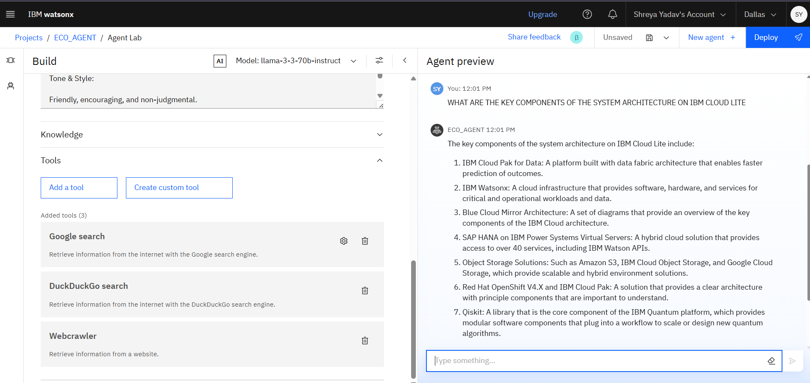

# 🌿 Eco Lifestyle Agent: AI-Powered Sustainable Living Assistant

> ⚠️ *This AI assistant is intended for informational and educational purposes only. It does **not** replace certified environmental or waste management advice.*

---

## 🌍 Introduction

**Eco Lifestyle Agent** is an **Agentic AI system** designed to help individuals adopt eco-friendly habits by delivering personalized, location-aware advice on sustainability, recycling, and green product alternatives.

Built using **IBM Watsonx**, the project combines the **Granite LLM** with **Retrieval-Augmented Generation (RAG)** and real-time search tools to offer reliable, actionable responses.

---

## ❓ Problem Statement

With the increasing threat of climate change, people want to contribute to sustainability but are often confused by inconsistent information, unclear recycling rules, and greenwashing in product marketing. A personalized assistant that guides eco-actions in a clear, context-aware manner can empower impactful decisions.

---

## ✅ Proposed Solution

The **Eco Lifestyle Agent** provides:
- Natural language understanding of sustainability-related queries
- Personalized advice based on user location and lifestyle
- Credible product suggestions and eco-alternatives
- Local recycling rules and disposal tips
- Verified, traceable sources for all information

---

## 🚀 Features

- **🌱 Eco-Aware Conversational AI**  
  Understands everyday environmental queries like “How to dispose of plastic in Dallas?”

- **🧾 Localized Recycling Info**  
  Offers region-specific plastic, e-waste, and composting guidelines.

- **🛒 Sustainable Product Finder**  
  Recommends reusable, biodegradable, or low-waste alternatives.

- **🔍 Source-Credible Answers**  
  Uses RAG with tools like Google, DuckDuckGo, and WebCrawler.

- **🧠 Powered by IBM Granite**  
  Uses LLM `llama-3-3-70b-instruct` or `granite-3-3-8b-instruct` via Watsonx Agent Lab.

---

## 🛠️ Tech Stack

| Category         | Tool/Tech |
|------------------|-----------|
| LLM Model        | `llama-3-3-70b-instruct` (IBM Granite optional) |
| Agent Platform   | IBM watsonx.ai (Agent Lab) |
| Architecture     | Agentic AI (ReAct Pattern) |
| Retrieval        | RAG + External tools |
| Tools Used       | Google Search, DuckDuckGo, WebCrawler |
| Style & Tone     | Friendly, Encouraging, Non-Judgmental |
| Hosting          | Runtime `24.1-py3.11` with 1 CPU / 2 GB RAM |

---

## 🔄 How It Works

---
## MVP

---
## Future Enhancements

We envision several exciting future developments for the HealthWise Agent:
<ul>
<li>Voice-based assistant for low-literacy or elderly users</li>

<li>Smart home & wearable integration</li>

<li>Carbon footprint tracker</li>

<li>Eco-point gamification and rewards system</li>

<li>Partnership with local NGOs and recycling units
</li>
<li>Expansion to multilingual and rural-friendly versions
</li>
</ul>
